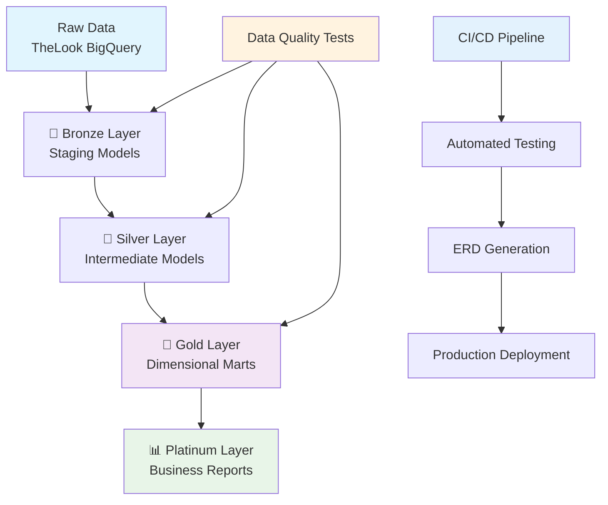
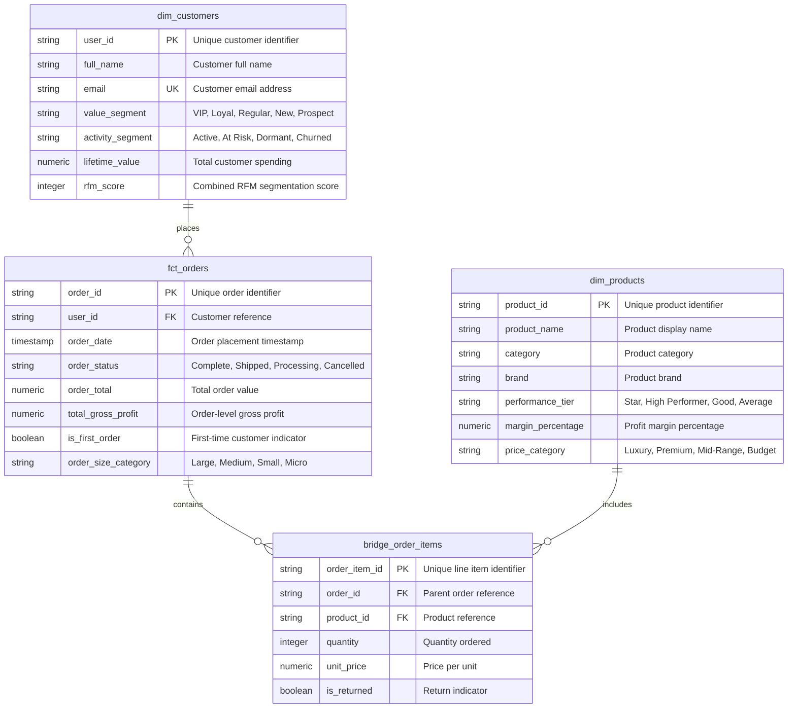

# Retail Analytics Framework
*Enterprise-Grade Data Platform for Retail Intelligence*

[](https://www.getdbt.com/)
[](https://cloud.google.com/bigquery)
[](https://python.org/)
[](https://github.com/features/actions)

[](https://yourusername.github.io/retail-analytics-framework/)
[](https://github.com/yourusername/retail-analytics-framework)
[](LICENSE)

> **Production-Ready Analytics Platform**: Demonstrating enterprise-grade data engineering capabilities with comprehensive testing, advanced DBT patterns, CI/CD automation, and modern data stack integration.

---

## 🎯 Platform Overview

The **Retail Analytics Framework** is a scalable, production-ready analytics platform built on Google's TheLook retail dataset. This framework demonstrates advanced analytics engineering patterns, enterprise data quality management, and modern data stack implementation suitable for retail organizations of any size.

### **Business Impact**
- **Customer Intelligence**: 360° customer analytics with lifetime value, segmentation, and behavioral insights
- **Product Performance**: Advanced margin analysis, inventory optimization, and performance tracking
- **Revenue Operations**: Real-time revenue monitoring, forecasting, and growth analysis
- **Operational Excellence**: Automated data quality monitoring and self-service analytics capabilities

### **Technical Excellence**
- **Production Architecture**: Medallion pattern with comprehensive testing framework
- **Advanced DBT Patterns**: Incremental models, SCD Type 2, custom macros, and performance optimization
- **Data Quality Engineering**: Multi-layered testing strategy with realistic data handling
- **CI/CD Automation**: GitHub Actions pipeline with automated testing and ERD generation
- **Scalable Design**: Built to handle 100K+ transactions with architecture for enterprise growth

---

## 🏗️ Architecture & Data Flow

### **Medallion Architecture Implementation**

```mermaid
graph TB
    A[Raw Data<br/>TheLook BigQuery] --> B[🥉 Bronze Layer<br/>Staging Models]
    B --> C[🥈 Silver Layer<br/>Intermediate Models] 
    C --> D[🥇 Gold Layer<br/>Dimensional Marts]
    D --> E[📊 Platinum Layer<br/>Business Reports]
    
    F[Data Quality Tests] --> B
    F --> C
    F --> D
    
    G[CI/CD Pipeline] --> H[Automated Testing]
    H --> I[ERD Generation]
    I --> J[Production Deployment]
    
    style A fill:#e1f5fe
    style D fill:#f3e5f5
    style E fill:#e8f5e8
    style F fill:#fff3e0
    style G fill:#e3f2fd
```

**🥉 Bronze Layer (Staging)**: Data standardization, type casting, and quality issue flagging  
**🥈 Silver Layer (Intermediate)**: Business logic application and reusable calculations  
**🥇 Gold Layer (Marts)**: Dimensional models optimized for analytics consumption  
**📊 Platinum Layer (Reports)**: Business-ready aggregations and KPI calculations

### **Technology Stack**

| Component | Technology | Purpose |
|-----------|------------|---------|
| **Data Warehouse** | Google BigQuery | Scalable cloud analytics database |
| **Transformation** | DBT Core | Data modeling and transformation framework |
| **CI/CD** | GitHub Actions | Automated testing, ERD generation, deployment |
| **Documentation** | DBT Docs + dbterd | Auto-generated data lineage and ERD diagrams |
| **Quality Assurance** | Custom Test Suite | Comprehensive data validation framework |
| **Version Control** | Git/GitHub | Code versioning and collaboration |
| **Orchestration** | *Planned: Apache Airflow* | Workflow scheduling and monitoring |

---

## 🔄 CI/CD Pipeline

### **Automated Workflow**

| Trigger | Jobs That Run |
|---------|---------------|
| Push to `feature/**` | Compile → Build & Test |
| Pull Request to `main` | Compile → Build & Test → Generate Docs |
| Merge to `main` | Compile → Build & Test → Generate ERD |

### **Pipeline Features**
- **🔍 Compile**: Validates dbt syntax without BigQuery costs
- **🏗️ Build & Test**: Creates ephemeral datasets, runs all models and tests
- **📊 ERD Generation**: Auto-generates Entity Relationship Diagram on merge
- **📚 Docs Artifact**: Uploads dbt documentation for PR review
- **🧹 Auto Cleanup**: Removes CI datasets after completion

### **Documentation**
- [CI/CD Pipeline Guide](docs/CI_CD_README.md)
- [Data Model ERD](docs/erd.md)

---

## 📊 Data Model & Schema

### **Dimensional Model Overview**

> **[View Interactive ERD](docs/erd.md)** - Auto-generated and always up-to-date


```mermaid
erDiagram
    fct_orders {
        string order_id PK "Unique order identifier"
        string user_id FK "Customer reference"
        timestamp order_date "Order placement timestamp"
        string order_status "Complete, Shipped, Processing, Cancelled"
        numeric order_total "Total order value"
        numeric total_gross_profit "Order-level gross profit"
        boolean is_first_order "First-time customer indicator"
        string order_size_category "Large, Medium, Small, Micro"
    }
    
    dim_customers {
        string user_id PK "Unique customer identifier"
        string full_name "Customer full name"
        string email UK "Customer email address"
        string value_segment "VIP, Loyal, Regular, New, Prospect"
        string activity_segment "Active, At Risk, Dormant, Churned"
        numeric lifetime_value "Total customer spending"
        integer rfm_score "Combined RFM segmentation score"
    }
    
    dim_products {
        string product_id PK "Unique product identifier"
        string product_name "Product display name"
        string category "Product category"
        string brand "Product brand"
        string performance_tier "Star, High Performer, Good, Average"
        numeric margin_percentage "Profit margin percentage"
        string price_category "Luxury, Premium, Mid-Range, Budget"
    }
    
    bridge_order_items {
        string order_item_id PK "Unique line item identifier"
        string order_id FK "Parent order reference"
        string product_id FK "Product reference"
        integer quantity "Quantity ordered"
        numeric unit_price "Price per unit"
        boolean is_returned "Return indicator"
    }

    fct_orders ||--o{ bridge_order_items : "contains"
    dim_customers ||--o{ fct_orders : "places"
    dim_products ||--o{ bridge_order_items : "includes"
```

### 🔗 **[Interactive Data Documentation](https://yourusername.github.io/retail-analytics-framework/)**

---

## 🚀 Quick Start Guide

### **Prerequisites**
- Google Cloud Platform account with BigQuery API enabled
- Python 3.8+ with pip installed
- Git for version control
- (Optional) Docker for containerized development

### **1. Environment Setup**
```bash
# Clone the repository
git clone https://github.com/yourusername/retail-analytics-framework.git
cd retail-analytics-framework

# Create and activate virtual environment
python -m venv venv
source venv/bin/activate  # Windows: venv\Scripts\activate

# Install dependencies
pip install -r requirements.txt
```

### **2. DBT Configuration**
```bash
# Configure profiles.yml with your GCP project
cp profiles_template.yml ~/.dbt/profiles.yml
# Edit ~/.dbt/profiles.yml with your BigQuery project details

# Verify connection
dbt debug

# Install DBT packages
dbt deps
```

### **3. Build the Platform**
```bash
# Phase 1: Build staging layer
dbt run --select tag:staging
dbt test --select tag:staging

# Phase 2: Build business logic
dbt run --select tag:intermediate
dbt run --select tag:marts

# Phase 3: Generate reports
dbt run --select tag:reports
dbt test

# Generate documentation
dbt docs generate
dbt docs serve --port 8080
```

### **4. Validation & Testing**
```sql
-- Verify platform deployment
SELECT 
    COUNT(*) as total_orders,
    COUNT(DISTINCT user_id) as unique_customers,
    ROUND(SUM(order_total), 2) as total_revenue
FROM {{ ref('fct_orders') }}
WHERE order_status = 'Complete';
```

---

## 📁 Project Structure

```
retail-analytics-framework/
├── 📁 .github/workflows/          # CI/CD automation
│   └── dbt-ci.yml                # GitHub Actions workflow
├── 📁 analyses/                   # Ad-hoc analytical queries
├── 📁 dbt_packages/               # DBT package dependencies
├── 📁 docs/                       # Documentation
│   ├── CI_CD_README.md           # CI/CD pipeline guide
│   └── erd.md                    # Auto-generated ERD
├── 📁 macros/                     # Reusable SQL macros
│   ├── 📁 tests/  
│   │   └── generate_alias_name.sql
│   ├── business_logic.sql
│   └── generate_schema_name.sql
├── 📁 models/                     # DBT models by layer
│   ├── 📁 staging/               # 🥉 Bronze: Data cleaning & standardization
│   │   ├── _sources.yml
│   │   ├── stg_orders.sql
│   │   ├── stg_users.sql
│   │   └── stg_products.sql
│   ├── 📁 intermediate/          # 🥈 Silver: Business logic & calculations
│   │   ├── int_customer_metrics.sql
│   │   ├── int_order_enriched.sql
│   │   └── int_product_performance.sql
│   ├── 📁 marts/                 # 🥇 Gold: Dimensional models
│   │   ├── _core_models.yml      # Schema with relationship tests
│   │   ├── dim_customers.sql
│   │   ├── dim_products.sql
│   │   ├── fct_orders.sql
│   │   └── bridge_order_items.sql
│   └── 📁 reports/               # 📊 Platinum: Business aggregations
│       ├── rpt_customer_lifetime_value.sql
│       ├── rpt_product_performance.sql
│       └── rpt_revenue_trends.sql
├── 📁 seeds/                      # Reference data & lookup tables
├── 📁 snapshots/                  # SCD Type 2 implementations
│   └── snap_products.sql
├── 📁 tests/                      # Custom test definitions
│   ├── generic/                   # Reusable test macros
│   └── singular/                  # Model-specific tests
├── 📁 scripts/                    # Utility scripts
├── dbt_project.yml               # DBT project configuration
├── packages.yml                  # DBT package dependencies
├── requirements.txt              # Python dependencies
└── README.md                     # This documentation
```

---

## 🧪 Enterprise Data Quality Framework

### **Comprehensive Testing Strategy**

**Production Data Quality Approach**: This framework handles realistic retail data quality challenges professionally, treating data issues as business requirements rather than technical problems.

| Test Category | Coverage | Business Impact |
|---------------|----------|-----------------|
| **Data Integrity** | Primary keys, foreign keys, uniqueness | Prevents analytical errors |
| **Business Rules** | Age ranges, valid statuses, logical constraints | Ensures business logic compliance |
| **Data Freshness** | Source data recency, processing windows | Maintains timely insights |
| **Relationship Tests** | Foreign key validation, ERD generation | Enables automated documentation |
| **Custom Validation** | Retail-specific rules, cross-model consistency | Domain expertise demonstration |

### **Relationship Tests for ERD**
*Relationship tests serve dual purposes: data quality validation and ERD generation*

```yaml
# Example: Relationship test in _core_models.yml
models:
  - name: fct_orders
    columns:
      - name: user_id
        tests:
          - relationships:
              to: ref('dim_users')
              field: user_id
              config:
                severity: warn
```

### **Known Data Quality Patterns**
*Professional approach to realistic retail data challenges:*

```yaml
# Example: Handling duplicate customer emails (realistic business scenario)
tests:
  - unique:
      column_name: email
      config:
        severity: warn                    # Business decision: warn, don't fail
        error_if: ">5000"                # Escalate if problem grows significantly  
        warn_if: ">0"                    # Always log for monitoring
        where: "email IS NOT NULL"       # Focus on meaningful duplicates
```

**Business Context**: In production retail environments:
- ✅ **Age outliers** (870 records) - Handled with business rules, not data rejection
- ✅ **Email duplicates** (3,702 records) - Managed through recency-based deduplication
- ✅ **Referential gaps** (16,395 records) - Filtered with proper logging and monitoring

---

## ⚡ Advanced DBT Patterns Demonstrated

### **1. Advanced Incremental Models**
```sql
-- Enterprise-grade daily revenue aggregation with comprehensive business metrics
{{ config(
    materialized='incremental',
    unique_key='revenue_date',
    incremental_strategy='merge',
    partition_by={
        "field": "revenue_date",
        "data_type": "date"
    },
    tags=['marts', 'finance', 'daily']
) }}

with daily_aggregates as (
    select
        date(order_date) as revenue_date,
        
        -- Core revenue metrics
        sum(order_total) as total_revenue,
        sum(net_order_total) as net_revenue,
        sum(total_gross_profit) as total_gross_profit,
        avg(order_total) as avg_order_value,
        
        -- Customer acquisition intelligence
        count(case when is_first_order then 1 end) as new_customers,
        count(case when not is_first_order then 1 end) as returning_customers,
        count(distinct user_id) as unique_customers,
        
        -- Geographic distribution analysis
        count(case when is_domestic_customer then 1 end) as domestic_orders,
        count(distinct customer_state) as states_with_orders,
        count(distinct customer_country) as countries_with_orders,
        
        -- Customer segmentation breakdown
        count(case when customer_segment_at_order = 'VIP' then 1 end) as vip_orders,
        count(case when customer_segment_at_order = 'Loyal' then 1 end) as loyal_orders,
        
        -- Performance indicators
        avg(delivery_days) as avg_delivery_days,
        count(case when delivery_days <= 3 then 1 end) as fast_deliveries

    from {{ ref('fct_orders') }}
    where order_status in ('Complete', 'Shipped', 'Processing')
    
    
        -- Smart lookback window for late-arriving data
        and date(order_date) >= (
            select date_sub(max(revenue_date), interval 3 day)
            from {{ this }}
        )
    
    
    group by 1
)

select
    *,
    -- Advanced business intelligence calculations
    safe_divide(total_gross_profit, total_revenue) as gross_margin_rate,
    safe_divide(returning_customers, unique_customers) as returning_customer_rate,
    safe_divide(new_customers, unique_customers) as new_customer_rate,
    
    -- Year-over-year growth analysis
    lag(total_revenue, 365) over (order by revenue_date) as revenue_ly,
    safe_divide(
        total_revenue - lag(total_revenue, 365) over (order by revenue_date),
        lag(total_revenue, 365) over (order by revenue_date)
    ) as revenue_yoy_growth,
    
    -- Trend analysis with moving averages
    avg(total_revenue) over (
        order by revenue_date 
        rows between 6 preceding and current row
    ) as revenue_7day_avg,
    
    avg(total_revenue) over (
        order by revenue_date 
        rows between 29 preceding and current row
    ) as revenue_30day_avg,
    
    -- Performance classification
    case 
        when total_revenue > avg(total_revenue) over (
            order by revenue_date rows between 29 preceding and current row
        ) * 1.2 then 'High Performance'
        when total_revenue < avg(total_revenue) over (
            order by revenue_date rows between 29 preceding and current row
        ) * 0.8 then 'Low Performance'
        else 'Normal Performance'
    end as daily_performance_status

from daily_aggregates
```

**🔗 [View Complete Implementation](models/marts/fct_daily_revenue.sql)**

### **2. SCD Type 2 Implementation**
```sql
-- Product price history tracking

    {{
        config(
            target_schema='snapshots',
            unique_key='product_id',
            strategy='timestamp',
            updated_at='updated_at'
        )
    }}
    SELECT * FROM {{ source('thelook', 'products') }}

```

### **3. Custom Business Logic Macros**
```sql
-- Comprehensive RFM customer segmentation macro with business intelligence

with rfm_calc as (
    select
        {{ customer_col }},
        -- Recency: Days since last purchase (lower is better)
        date_diff(current_date(), max(date({{ date_col }})), day) as recency_days,
        -- Frequency: Number of purchases (higher is better)
        count(*) as frequency,
        -- Monetary: Total customer value (higher is better)
        sum({{ revenue_col }}) as monetary
    from {{ table_name }}
    group by {{ customer_col }}
),
rfm_scores as (
    select
        *,
        -- Quintile scoring (1-5 scale)
        ntile(5) over (order by recency_days desc) as recency_score,
        ntile(5) over (order by frequency) as frequency_score,
        ntile(5) over (order by monetary) as monetary_score
    from rfm_calc
)
select
    *,
    -- Combined RFM segment identifier
    concat(
        cast(recency_score as string),
        cast(frequency_score as string),
        cast(monetary_score as string)
    ) as rfm_segment,
    
    -- Business-ready customer classifications
    case
        when recency_score >= 4 and frequency_score >= 4 and monetary_score >= 4 
            then 'Champions'
        when recency_score >= 3 and frequency_score >= 4 and monetary_score >= 4 
            then 'Loyal Customers'
        when recency_score >= 4 and frequency_score <= 2 and monetary_score >= 3 
            then 'Potential Loyalists'
        when recency_score >= 4 and frequency_score <= 2 and monetary_score <= 2 
            then 'New Customers'
        when recency_score >= 3 and frequency_score >= 3 and monetary_score >= 3 
            then 'Promising'
        when recency_score <= 2 and frequency_score >= 3 and monetary_score >= 3 
            then 'At Risk'
        when recency_score <= 2 and frequency_score <= 2 and monetary_score >= 4 
            then 'Cannot Lose Them'
        else 'Others'
    end as rfm_segment_name
from rfm_scores


-- Usage example in customer segmentation model
select * from {{ calculate_rfm_scores(
    ref('fct_orders'), 
    'user_id', 
    'order_date', 
    'order_total'
) }}
```

**🔗 [View Complete Macro Implementation](macros/business_logic.sql)**

---

## 📊 Sample Analytics & Business Intelligence

*Showcasing advanced SQL patterns and business-focused analytics capabilities*

### **Customer Segmentation Analysis**
```sql
-- RFM-based customer value segmentation
WITH customer_rfm AS (
    SELECT 
        user_id,
        NTILE(5) OVER (ORDER BY days_since_last_order DESC) as recency_score,
        NTILE(5) OVER (ORDER BY total_orders ASC) as frequency_score,
        NTILE(5) OVER (ORDER BY lifetime_value ASC) as monetary_score
    FROM {{ ref('dim_customers') }}
),
segmentation AS (
    SELECT 
        user_id,
        CASE 
            WHEN recency_score >= 4 AND frequency_score >= 4 AND monetary_score >= 4 THEN 'VIP'
            WHEN recency_score >= 3 AND frequency_score >= 3 THEN 'Loyal'
            WHEN recency_score >= 3 THEN 'Regular'
            WHEN recency_score >= 2 THEN 'At Risk'
            ELSE 'Churned'
        END as value_segment
    FROM customer_rfm
)
SELECT 
    value_segment,
    COUNT(*) as customer_count,
    ROUND(AVG(lifetime_value), 2) as avg_ltv,
    ROUND(AVG(total_orders), 1) as avg_orders
FROM {{ ref('dim_customers') }} c
JOIN segmentation s ON c.user_id = s.user_id
GROUP BY value_segment
ORDER BY avg_ltv DESC;
```

### **Product Performance Intelligence**
```sql
-- Advanced product performance analysis with tier classification
WITH product_metrics AS (
    SELECT 
        p.product_id,
        p.category,
        p.brand,
        COUNT(DISTINCT oi.order_id) as total_orders,
        SUM(oi.quantity) as units_sold,
        SUM(oi.quantity * oi.unit_price) as total_revenue,
        AVG(p.margin_percentage) as avg_margin,
        COUNT(DISTINCT oi.user_id) as unique_customers
    FROM {{ ref('dim_products') }} p
    JOIN {{ ref('bridge_order_items') }} oi ON p.product_id = oi.product_id
    WHERE oi.is_returned = FALSE
    GROUP BY 1, 2, 3, p.margin_percentage
),
performance_tiers AS (
    SELECT *,
        CASE 
            WHEN total_revenue >= PERCENTILE_CONT(0.9) OVER () AND avg_margin >= 0.3 THEN 'Star'
            WHEN total_revenue >= PERCENTILE_CONT(0.7) OVER () THEN 'High Performer'
            WHEN total_revenue >= PERCENTILE_CONT(0.3) OVER () THEN 'Good'
            ELSE 'Average'
        END as performance_tier
    FROM product_metrics
)
SELECT 
    category,
    performance_tier,
    COUNT(*) as product_count,
    ROUND(SUM(total_revenue), 0) as category_revenue,
    ROUND(AVG(avg_margin) * 100, 1) as avg_margin_pct
FROM performance_tiers
GROUP BY 1, 2
ORDER BY category, category_revenue DESC;
```

**🔗 [View Complete Model Implementation](models/marts/dim_products.sql)**

---

## 🚀 Development Roadmap

### **Current Status: Core Platform + CI/CD** ✅ 
*Fully functional analytics framework with automated pipeline*

- ✅ **Medallion Architecture**: Complete bronze → silver → gold → platinum data flow
- ✅ **Advanced DBT Models**: Staging, intermediate, marts, and reports layers
- ✅ **Data Quality Framework**: Comprehensive testing with realistic data handling
- ✅ **CI/CD Pipeline**: GitHub Actions with automated testing and ERD generation
- ✅ **Performance Optimization**: BigQuery partitioning, clustering, and incremental models
- ✅ **Business Intelligence**: Customer analytics, product performance, revenue analysis
- ✅ **Documentation**: Auto-generated DBT docs with data lineage and ERD

### **Phase 1: CI/CD Enhancements** 🚧 *Next Priority*
*Advanced automation and optimization*

- [ ] **Slim CI**: Only build modified models for faster feedback
- [ ] **Production Deployment**: Automated deployment to production environment
- [ ] **dbt Docs Hosting**: GitHub Pages for documentation
- [ ] **Performance Monitoring**: Query optimization and cost tracking

### **Phase 2: Enterprise Orchestration** 📋 *Planned*
*Advanced workflow management and scheduling*

- [ ] **Apache Airflow Integration**: Production DAGs with dependency management
- [ ] **SLA Monitoring**: Business continuity and performance tracking  
- [ ] **Advanced Alerting**: Slack/email notifications for failures and anomalies
- [ ] **Resource Optimization**: Dynamic scaling and cost management

### **Phase 3: Advanced Analytics** 🎯 *Future*
*Machine learning and real-time capabilities*

- [ ] **ML Integration**: Customer churn prediction, demand forecasting
- [ ] **Real-time Processing**: Streaming data with Kafka/Pub Sub
- [ ] **Self-Service Analytics**: Business user interface and query builder
- [ ] **Advanced Segmentation**: Behavioral clustering, propensity modeling

---

## 🚢 Deployment & Operations

### **CI/CD Workflow**
*Automated deployment pipeline*

```bash
# CI automatically runs on every push:
# 1. Compile - Validates syntax
# 2. Build - Runs models in ephemeral dataset
# 3. Test - Executes all data tests
# 4. ERD - Generates diagram (on merge to main)
```

### **Manual Development Workflow**
```bash
# Local development
dbt deps                          # Install packages
dbt compile                       # Validate models
dbt run --select tag:staging      # Build staging layer
dbt test --select tag:staging     # Validate staging data

# Full pipeline execution
dbt run                           # Build all models
dbt test                          # Run all tests
dbt docs generate                 # Generate documentation
dbt docs serve                    # Serve documentation locally
```

### **Data Quality Management**
- **Test Coverage**: 60+ tests across all layers with appropriate severity levels
- **Relationship Tests**: Enable automatic ERD generation
- **Quality Monitoring**: Automated execution in CI pipeline
- **Issue Resolution**: Systematic approach to data quality exceptions

---

## 🎯 Portfolio Highlights

### **Technical Expertise Demonstrated**
- ✅ **Advanced Analytics Engineering**: Complex DBT patterns, medallion architecture
- ✅ **Data Quality Engineering**: Comprehensive testing, realistic data handling
- ✅ **DevOps & CI/CD**: GitHub Actions pipeline, automated testing, ERD generation
- ✅ **Performance Engineering**: BigQuery optimization, incremental processing  
- ✅ **Business Intelligence**: Customer analytics, product performance, revenue analysis
- ✅ **Production Readiness**: Scalable architecture, error handling, documentation

### **Business Value Delivered**
- **360° Customer Intelligence**: Segmentation, lifetime value, behavioral insights
- **Product Portfolio Optimization**: Performance analytics, margin analysis
- **Revenue Operations**: Forecasting, trend analysis, growth metrics
- **Operational Efficiency**: Automated testing, self-documenting data models

### **Enterprise Readiness**
- **Scalable Architecture**: Handles 100K+ orders, designed for enterprise growth
- **Production Patterns**: Error handling, performance optimization, comprehensive documentation
- **Automated Pipeline**: CI/CD with ephemeral datasets and auto-cleanup
- **Development Approach**: Systematic build process, thorough testing, iterative enhancement

---

## 🤝 Professional Contact

**Analytics Engineer & Data Platform Specialist**

- 📧 **Email**: 
- 💼 **LinkedIn**: 
- 📱 **GitHub**: [@azadsolanki](https://github.com/azadsolanki)

### **Expertise Showcase**
This framework demonstrates comprehensive analytics engineering capabilities including advanced DBT patterns, enterprise data quality management, CI/CD automation, and business-focused analytics solutions suitable for retail organizations seeking scalable, reliable data platforms.

---

## 📄 License & Acknowledgments

This project is licensed under the MIT License - see the [LICENSE](LICENSE) file for details.

**Built with modern data stack technologies:**
- [DBT](https://www.getdbt.com/) for transformation framework
- [Google BigQuery](https://cloud.google.com/bigquery) for analytics database
- [GitHub Actions](https://github.com/features/actions) for CI/CD automation
- [dbterd](https://github.com/datnguye/dbterd) for ERD generation
- [Apache Airflow](https://airflow.apache.org/) for orchestration *(planned)*

---

*Engineered by a data professional passionate about building reliable, scalable, and business-focused analytics platforms that drive real organizational value.*

**⭐ Interested in discussing how this framework approach could benefit your organization? Let's connect!**
