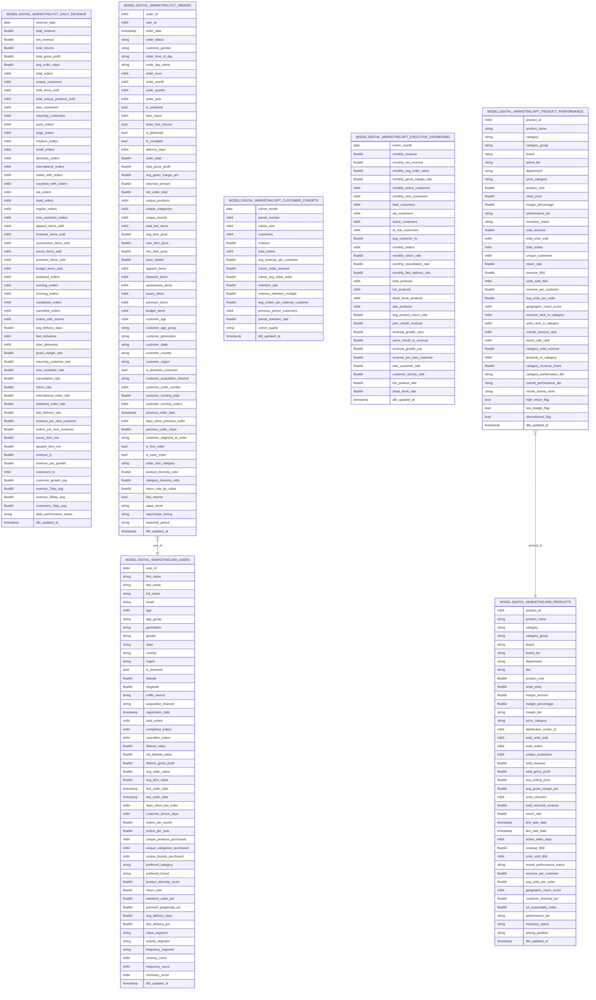

# Data Model ERD

Auto-generated from dbt relationship tests.

```mermaid
erDiagram
  "MODEL.DIGITAL_MARKETING.DIM_PRODUCTS" {
    int64 product_id
    string product_name
    string category
    string category_group
    string brand
    string brand_tier
    string department
    string sku
    float64 product_cost
    float64 retail_price
    float64 margin_amount
    float64 margin_percentage
    string margin_tier
    string price_category
    int64 distribution_center_id
    int64 total_units_sold
    int64 total_orders
    int64 unique_customers
    float64 total_revenue
    float64 total_gross_profit
    float64 avg_selling_price
    float64 avg_gross_margin_pct
    int64 units_returned
    float64 total_returned_revenue
    float64 return_rate
    timestamp first_sale_date
    timestamp last_sale_date
    int64 active_sales_days
    float64 revenue_90d
    int64 units_sold_90d
    string recent_performance_status
    float64 revenue_per_customer
    float64 avg_units_per_order
    int64 geographic_reach_score
    float64 customer_diversity_pct
    float64 q4_seasonality_index
    string performance_tier
    string inventory_status
    string pricing_position
    timestamp dbt_updated_at
  }
  "MODEL.DIGITAL_MARKETING.DIM_USERS" {
    int64 user_id
    string first_name
    string last_name
    string full_name
    string email
    int64 age
    string age_group
    string generation
    string gender
    string state
    string country
    string region
    bool is_domestic
    float64 latitude
    float64 longitude
    string traffic_source
    string acquisition_channel
    timestamp registration_date
    int64 total_orders
    int64 completed_orders
    int64 cancelled_orders
    float64 lifetime_value
    float64 net_lifetime_value
    float64 lifetime_gross_profit
    float64 avg_order_value
    float64 avg_item_value
    timestamp first_order_date
    timestamp last_order_date
    int64 days_since_last_order
    int64 customer_tenure_days
    float64 orders_per_month
    float64 orders_per_year
    int64 unique_products_purchased
    int64 unique_categories_purchased
    int64 unique_brands_purchased
    string preferred_category
    string preferred_brand
    float64 product_diversity_score
    float64 return_rate
    float64 weekend_order_pct
    float64 premium_propensity_pct
    float64 avg_delivery_days
    float64 fast_delivery_pct
    string value_segment
    string activity_segment
    string frequency_segment
    int64 recency_score
    int64 frequency_score
    int64 monetary_score
    timestamp dbt_updated_at
  }
  "MODEL.DIGITAL_MARKETING.FCT_DAILY_REVENUE" {
    date revenue_date
    float64 total_revenue
    float64 net_revenue
    float64 total_returns
    float64 total_gross_profit
    float64 avg_order_value
    int64 total_orders
    int64 unique_customers
    int64 total_items_sold
    int64 total_unique_products_sold
    int64 new_customers
    int64 returning_customers
    int64 early_orders
    int64 large_orders
    int64 medium_orders
    int64 small_orders
    int64 domestic_orders
    int64 international_orders
    int64 states_with_orders
    int64 countries_with_orders
    int64 vip_orders
    int64 loyal_orders
    int64 regular_orders
    int64 new_customer_orders
    int64 apparel_items_sold
    int64 footwear_items_sold
    int64 accessories_items_sold
    int64 luxury_items_sold
    int64 premium_items_sold
    int64 budget_items_sold
    int64 weekend_orders
    int64 evening_orders
    int64 morning_orders
    int64 completed_orders
    int64 cancelled_orders
    int64 orders_with_returns
    float64 avg_delivery_days
    int64 fast_deliveries
    int64 slow_deliveries
    float64 gross_margin_rate
    float64 returning_customer_rate
    float64 new_customer_rate
    float64 cancellation_rate
    float64 return_rate
    float64 international_order_rate
    float64 weekend_order_rate
    float64 fast_delivery_rate
    float64 revenue_per_new_customer
    float64 orders_per_new_customer
    float64 luxury_item_mix
    float64 apparel_item_mix
    float64 revenue_ly
    float64 revenue_yoy_growth
    int64 customers_ly
    float64 customer_growth_yoy
    float64 revenue_7day_avg
    float64 revenue_30day_avg
    float64 customers_7day_avg
    string daily_performance_status
    timestamp dbt_updated_at
  }
  "MODEL.DIGITAL_MARKETING.FCT_ORDERS" {
    int64 order_id
    int64 user_id
    timestamp order_date
    string order_status
    string customer_gender
    string order_time_of_day
    string order_day_name
    int64 order_hour
    int64 order_month
    int64 order_quarter
    int64 order_year
    bool is_weekend
    int64 item_count
    bool order_has_returns
    bool is_delivered
    bool is_complete
    int64 delivery_days
    float64 order_total
    float64 total_gross_profit
    float64 avg_gross_margin_pct
    float64 returned_amount
    float64 net_order_total
    int64 unique_products
    int64 unique_categories
    int64 unique_brands
    int64 total_line_items
    float64 avg_item_price
    float64 max_item_price
    float64 min_item_price
    float64 price_stddev
    int64 apparel_items
    int64 footwear_items
    int64 accessories_items
    int64 luxury_items
    int64 premium_items
    int64 budget_items
    int64 customer_age
    string customer_age_group
    string customer_generation
    string customer_state
    string customer_country
    string customer_region
    bool is_domestic_customer
    string customer_acquisition_channel
    int64 customer_order_number
    float64 customer_running_total
    int64 customer_running_orders
    timestamp previous_order_date
    int64 days_since_previous_order
    float64 previous_order_value
    string customer_segment_at_order
    bool is_first_order
    bool is_early_order
    string order_size_category
    float64 product_diversity_ratio
    float64 category_diversity_ratio
    float64 return_rate_by_value
    bool has_returns
    string value_trend
    string repurchase_timing
    string seasonal_period
    timestamp dbt_updated_at
  }
  "MODEL.DIGITAL_MARKETING.RPT_CUSTOMER_COHORTS" {
    date cohort_month
    int64 period_number
    int64 cohort_size
    int64 customers
    float64 revenue
    int64 total_orders
    float64 avg_revenue_per_customer
    float64 cohort_initial_revenue
    float64 cohort_avg_initial_order
    float64 retention_rate
    float64 revenue_retention_multiple
    float64 avg_orders_per_retained_customer
    int64 previous_period_customers
    float64 period_retention_rate
    string cohort_quality
    timestamp dbt_updated_at
  }
  "MODEL.DIGITAL_MARKETING.RPT_EXECUTIVE_DASHBOARD" {
    date metric_month
    float64 monthly_revenue
    float64 monthly_net_revenue
    float64 monthly_avg_order_value
    float64 monthly_gross_margin_rate
    int64 monthly_active_customers
    int64 monthly_new_customers
    int64 total_customers
    int64 vip_customers
    int64 active_customers
    int64 at_risk_customers
    float64 avg_customer_ltv
    int64 monthly_orders
    float64 monthly_return_rate
    float64 monthly_cancellation_rate
    float64 monthly_fast_delivery_rate
    int64 total_products
    int64 hot_products
    int64 dead_stock_products
    int64 star_products
    float64 avg_product_return_rate
    float64 prev_month_revenue
    float64 revenue_growth_mom
    float64 same_month_ly_revenue
    float64 revenue_growth_yoy
    float64 revenue_per_new_customer
    float64 new_customer_rate
    float64 customer_activity_rate
    float64 hot_product_rate
    float64 dead_stock_rate
    timestamp dbt_updated_at
  }
  "MODEL.DIGITAL_MARKETING.RPT_PRODUCT_PERFORMANCE" {
    int64 product_id
    string product_name
    string category
    string category_group
    string brand
    string brand_tier
    string department
    string price_category
    float64 product_cost
    float64 retail_price
    float64 margin_percentage
    string performance_tier
    string inventory_status
    float64 total_revenue
    int64 total_units_sold
    int64 total_orders
    int64 unique_customers
    float64 return_rate
    float64 revenue_90d
    int64 units_sold_90d
    float64 revenue_per_customer
    float64 avg_units_per_order
    int64 geographic_reach_score
    int64 revenue_rank_in_category
    int64 units_rank_in_category
    int64 overall_revenue_rank
    int64 return_rate_rank
    float64 category_total_revenue
    int64 products_in_category
    float64 category_revenue_share
    string category_performance_tier
    string overall_performance_tier
    string recent_activity_level
    bool high_return_flag
    bool low_margin_flag
    bool discontinued_flag
    timestamp dbt_updated_at
  }
  "MODEL.DIGITAL_MARKETING.FCT_ORDERS" }|--|| "MODEL.DIGITAL_MARKETING.DIM_USERS": user_id
  "MODEL.DIGITAL_MARKETING.RPT_PRODUCT_PERFORMANCE" }|--|| "MODEL.DIGITAL_MARKETING.DIM_PRODUCTS": product_id
```
